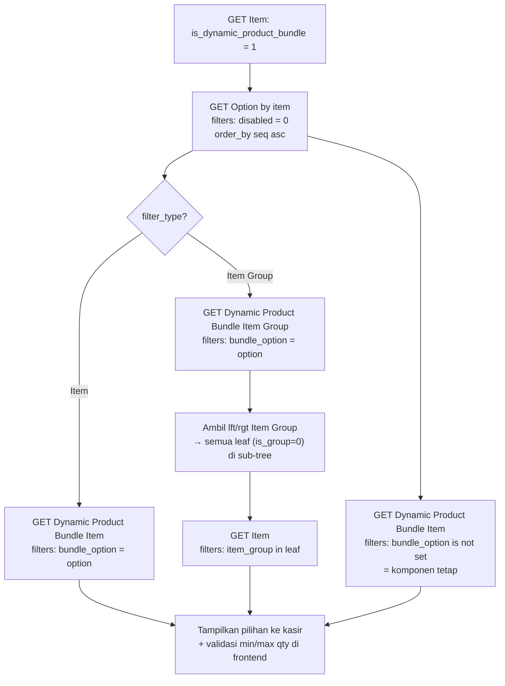

# PRD — REST API Dynamic Product Bundle (ERPNext / Frappe)

> Dokumen spesifikasi pemanggilan REST API untuk fitur **Dynamic Product Bundle** — paket/produk
> yang **isian komponennya dipilih dinamis oleh kasir saat transaksi** — di ERPNext (Frappe),
> diperuntukkan bagi tim **UI/Frontend**.

- **Modul:** Base App (custom app `baseapp`) — path `baseapp.base_app.doctype`
- **Doctype:** field `Item.is_dynamic_product_bundle` + 3 doctype baru:
  `Dynamic Product Bundle Option` (soft-delete `disabled`, pola sama `Product Bundle`),
  `Dynamic Product Bundle Item`, `Dynamic Product Bundle Item Group`
- **Versi API:** `/api/method/...` (API v1) — method whitelisted `frappe.client.*`, `name` dikirim di **body**
- **Autentikasi:** OAuth 2.0 — Authorization Code + Refresh Token
- **Format body:** JSON
- **Base URL:** ganti `https://site-anda.com` dengan alamat site Anda (mis. dev: `https://erpnext.localhost`)

> **Prasyarat:** app **`baseapp`** (module *Base App*) harus terpasang di site — field
> `is_dynamic_product_bundle` dan ketiga doctype di dokumen ini **disediakan oleh app tersebut**
> (tidak ada di ERPNext standar). Bila app belum terpasang, endpoint akan gagal `404 DoesNotExistError`.

> ⚠️ **Status implementasi — spesifikasi target.** Field **`disabled`** pada
> `Dynamic Product Bundle Option` (§2.2) **belum diterapkan** di `baseapp` saat dokumen ini dibuat
> (perubahan: tambah soft-delete `disabled` pada `Dynamic Product Bundle Option`). Sebelum perubahan
> di-deploy: jangan mengirim `disabled` pada `insert`/`save`/`set_value` dan jangan memakai filter
> `["disabled", ...]` pada `get_list` — sampai saat itu penyaringan "non-aktif" cukup di sisi UI.
> Bagian lain dokumen ini sesuai kondisi nyata saat ini.

---

## 1. Ruang lingkup

### 1.1 Pemetaan istilah kebutuhan → implementasi

| Istilah di kebutuhan | Implementasi (doctype / field) |
|---|---|
| Penanda item = paket dinamis | `Item.is_dynamic_product_bundle` (Check) |
| Daftar pilihan isian paket | doctype **`Dynamic Product Bundle Option`** |
| Nama pilihan isian paket | `Dynamic Product Bundle Option.option_name` |
| No urut | `Dynamic Product Bundle Option.seq` |
| Tipe filter (item / item group) | `Dynamic Product Bundle Option.filter_type` |
| Non-aktif (soft-delete) pilihan | `Dynamic Product Bundle Option.disabled` (Check, default `0`, pola sama `Product Bundle.disabled`) |
| Daftar item yang boleh dipilih / komponen tetap | doctype **`Dynamic Product Bundle Item`** |
| `parent` (spec awal) | → **`Dynamic Product Bundle Item.bundle_option`** (Link ke Option; **kosong = komponen tetap**) |
| Daftar item group yang boleh dipilih | doctype **`Dynamic Product Bundle Item Group`** |

> ⚠️ **Perbedaan dari `Product Bundle` bawaan ERPNext.** ERPNext sudah punya doctype `Product Bundle`
> (*static kit*: daftar komposisi tetap + qty, dipotong stoknya saat transaksi) — dibahas terpisah di
> **[prd_item_product_bundle.md](./prd_item_product_bundle.md)**. Fitur di dokumen ini
> **berbeda** — paket **dinamis** yang pilihannya ditentukan kasir. Keduanya tidak saling mengisi;
> jangan mencampur `Product Bundle` dengan `Dynamic Product Bundle*`.
> Satu pola yang **disamakan**: **soft-delete `disabled`** — `Product Bundle.disabled` pada paket
> statis, `Dynamic Product Bundle Option.disabled` pada pilihan isian paket dinamis (§2.2, §4.5).

### 1.2 Daftar endpoint

| # | Endpoint (POST `/api/method/...`) | Operasi | Doctype | `name` di |
|---|---|---|---|---|
| 1 | `frappe.client.set_value` | Aktifkan flag paket pada Item (§4.1) | `Item` | body |
| 2 | `frappe.client.get_list` | Daftar Item paket (dropdown, `flag=1`) (§4.1/§7.1) | `Item` | body (filters) |
| 3 | `frappe.client.insert` | Buat pilihan isian paket (CREATE) | `Dynamic Product Bundle Option` | body (`doc`) |
| 4 | `frappe.client.get` | Ambil detail 1 pilihan (READ) | `Dynamic Product Bundle Option` | body |
| 5 | `frappe.client.get_list` | Daftar pilihan paket (READ list, urut `seq`) | `Dynamic Product Bundle Option` | body (filters) |
| 6 | `frappe.client.save` / `set_value` | Ubah pilihan (UPDATE) | `Dynamic Product Bundle Option` | body |
| 7 | `frappe.client.get_count` | Total record sesuai filter (pagination) | `Dynamic Product Bundle Option` | body |
| 8 | `frappe.client.delete` | Hapus pilihan — **diblokir bila masih direferensikan** (§4.5) | `Dynamic Product Bundle Option` | body |
| 9 | `frappe.client.insert` | Tambah komponen tetap / item pilihan (CREATE) | `Dynamic Product Bundle Item` | body (`doc`) |
| 10 | `frappe.client.get` / `get_list` / `get_count` | Baca komponen per paket / per pilihan | `Dynamic Product Bundle Item` | body |
| 11 | `frappe.client.save` / `set_value` | Ubah qty / uom / pilihan (UPDATE) | `Dynamic Product Bundle Item` | body |
| 12 | `frappe.client.delete` | Hapus baris komponen | `Dynamic Product Bundle Item` | body |
| 13 | `frappe.client.insert` | Tambah item group pilihan (CREATE) | `Dynamic Product Bundle Item Group` | body (`doc`) |
| 14 | `frappe.client.get` / `get_list` / `get_count` | Baca item group per pilihan | `Dynamic Product Bundle Item Group` | body |
| 15 | `frappe.client.save` / `set_value` / `delete` | Ubah / hapus baris item group | `Dynamic Product Bundle Item Group` | body |
| 16 | `frappe.client.get_list` | Daftar UOM yang terdaftar pada sebuah Item (§7.2) | `Item` / `UOM Conversion Detail` | body (filters) |
| 17 | `frappe.client.get_list` | Daftar Item Group (dropdown) + resolve sub-tree (§6.5/§7.3) | `Item Group` | body (filters) |
| 18 | `frappe.client.get_list` | Daftar Item berdasarkan `item_group` (leaf) (§6.5/§7.4) | `Item` | body (filters) |
| 19 | `frappe.client.set_value` | Non-aktifkan / aktifkan kembali pilihan (`disabled`, §4.2/§4.5) | `Dynamic Product Bundle Option` | body |

> **Konvensi pemanggilan (penting):** seluruh operasi memakai method whitelisted **`frappe.client.*`**
> dengan `name` (dan filter) dikirim lewat **body JSON**, bukan di URL path — `name` dapat mengandung
> spasi / karakter khusus, sehingga body menghindari masalah URL-encoding di belakang nginx/proxy.
> **Format respons:** method `/api/method/...` membungkus hasil di **`"message"`** (bukan `"data"`
> seperti `/api/resource/...`).

### 1.3 Penyimpanan data

| Data | Tabel |
|---|---|
| Flag paket pada item | kolom `is_dynamic_product_bundle` di `tabItem` (custom field dari `baseapp`) |
| Pilihan isian paket | `tabDynamic Product Bundle Option` |
| Komponen tetap + item pilihan | `tabDynamic Product Bundle Item` |
| Item group pilihan | `tabDynamic Product Bundle Item Group` |

> **Scope dokumen ini = pengelolaan master (CRUD) + cara membaca struktur paket untuk kasir.**
> **Pilihan kasir saat transaksi tidak disimpan di ketiga doctype ini** — mekanisme simpan transaksi &
> pemotongan stok komponen berada di PRD transaksi/POS terpisah (lihat juga
> [prd_pos_profile.md](../setup/prd_pos_profile.md) untuk konfigurasi POS).

---

## 2. Ringkasan field & data

Legenda status: 🔴 **WAJIB** · 🟠 **DISARANKAN** · ⚪ **Otomatis / read-only — jangan dikirim** ·
✖️ **Tidak ada**.

### 2.1 `Item` — field flag paket dinamis

| Status | Field | Tipe | Keterangan |
|---|---|---|---|
| 🟠 **DISARANKAN** | `is_dynamic_product_bundle` | Check | `1` = item ini paket dinamis (boleh punya Option/komponen). Default `0`. **Custom field dari app `baseapp`** (fieldname sengaja **tanpa** prefix `custom_`), posisi setelah `is_stock_item`. |

> Item paket **disarankan** `is_stock_item = 0` (yang dipotong stok adalah komponennya, bukan paketnya)
> — sama seperti perilaku `Product Bundle` bawaan. Ini **tidak divalidasi backend**; frontend yang
> menentukan. Field Item lain (wajib/dianjurkan) ada di **[prd_item.md §2](./prd_item.md)**.

### 2.2 `Dynamic Product Bundle Option` — daftar pilihan isian paket

| Status | Field | Tipe | Keterangan |
|---|---|---|---|
| 🔴 **WAJIB** | `bundle_item` | Link → Item | Item paket pemilik pilihan ini. **Harus bertanda `is_dynamic_product_bundle = 1`** (backend menolak bila tidak). |
| 🔴 **WAJIB** | `option_name` | Data | Nama pilihan yang **bebas diisi user** (bukan Item Group). Contoh: `Daging`, `Sayur`, `Mainan`. |
| 🔴 **WAJIB** | `filter_type` | Select | `Item` = pilihan berupa daftar item; `Item Group` = pilihan berupa daftar item group. Default `Item`. |
| 🟠 | `seq` | Int | No urut tampil di kasir. Default `0`. Urutkan list dengan `order_by: "seq asc"`. |
| 🟠 | `min_qty` | Float | Batas **total qty minimal** yang wajib dipilih kasir dari pilihan ini. `0` = tidak wajib. |
| 🟠 | `max_qty` | Float | Batas **total qty maksimal** dari pilihan ini. `0` = tanpa batas. |
| 🟠 | `disabled` | Check | `1` = pilihan **non-aktif** — tidak boleh dipilih kasir & disaring dari daftar aktif (`["disabled","=",0]`). Default `0`. Definisi **sama** dengan `Product Bundle.disabled`: `in_standard_filter: 1`, `no_copy: 1`, label *Disabled*. **Spesifikasi target** — lihat catatan di awal dokumen. |
| ⚪ **Otomatis** | `name` | — | `"{option_name} - {bundle_item}"` (autoname `format:`). Contoh: `Daging - PAKET-BENTO-ANAK`. Jangan dikirim. |

### 2.3 `Dynamic Product Bundle Item` — komponen tetap **dan** item pilihan

| Status | Field | Tipe | Keterangan |
|---|---|---|---|
| 🔴 **WAJIB** | `bundle_item` | Link → Item | Paket pemilik baris ini (harus `is_dynamic_product_bundle = 1`). |
| 🔴 **WAJIB** | `item` | Link → Item | Item komponen (yang dipotong stok / dijual). Tidak boleh sama dengan `bundle_item`. |
| 🔴 **WAJIB** | `uom` | Link → UOM | **Otomatis terisi `stock_uom` item** saat dikosongkan; user boleh memilih UOM lain **yang terdaftar di item tsb** (§7.2). |
| 🟠 | `bundle_option` | Link → `Dynamic Product Bundle Option` | **Kosong `null` = komponen tetap** (selalu ikut, kasir tidak memilih). **Terisi = item pilihan** di bawah option tersebut — dan `option.filter_type` **wajib `Item`**. |
| 🟠 | `min_qty` | Float | Batas qty minimal **per item**. `0` = opsional (tidak wajib dipilih). |
| 🟠 | `max_qty` | Float | Batas qty maksimal **per item**. `0` = tanpa batas. |
| ⚪ **Otomatis** | `name` | — | Hash 10 karakter (tidak ada aturan naming khusus). |

### 2.4 `Dynamic Product Bundle Item Group` — item group pilihan

| Status | Field | Tipe | Keterangan |
|---|---|---|---|
| 🔴 **WAJIB** | `bundle_item` | Link → Item | Paket pemilik baris (harus `is_dynamic_product_bundle = 1`). |
| 🔴 **WAJIB** | `bundle_option` | Link → `Dynamic Product Bundle Option` | Opsi pemilik baris. `option.filter_type` **wajib `Item Group`**, dan `option.bundle_item` harus = `bundle_item`. |
| 🔴 **WAJIB** | `item_group` | Link → Item Group | Item group yang item-itemnya boleh dipilih kasir. **Termasuk sub-group turunannya** (§6.5). |
| ⚪ **Otomatis** | `name` | — | Hash 10 karakter. |

### 2.5 Catatan penting

1. **Autoname.** `Dynamic Product Bundle Option` → `name = "{option_name} - {bundle_item}"` (contoh:
   `Daging - PAKET-BENTO-ANAK`). Dua option dengan `option_name` + `bundle_item` sama akan **ditolak**
   (`DuplicateEntryError`). Kedua doctype lain memakai `name` hash — **pakai `name` dari respons CREATE**.
   Mengubah `option_name` pada dokumen yang ada **tidak** mengubah `name` (autoname hanya saat insert).
2. **`bundle_option` kosong: `null` vs `""` (penting).**
   - CREATE tanpa mengirim field, atau mengirim `null` → tersimpan **NULL**.
   - Mengirim `""` → tersimpan **string kosong `''`**.
   - Saat UPDATE (`frappe.client.save`): `null` **menghapus** relasi (jadi NULL); `""` juga mengosongkan.
   - Filter `["bundle_option","is","not set"]` **cocok untuk NULL *dan* `''`** → **pakai filter ini**
     untuk mencari komponen tetap. (Cek duplikat backend juga memperlakukan NULL dan `''` sama.)
3. **Konsistensi `filter_type` ↔ tabel (divalidasi backend).**
   - Option `filter_type = "Item"` → hanya boleh diisi baris di **`Dynamic Product Bundle Item`**
     (dengan `bundle_option` = option tsb).
   - Option `filter_type = "Item Group"` → hanya boleh diisi baris di
     **`Dynamic Product Bundle Item Group`**.
   - Salah tabel → `ValidationError` (lihat §8).
4. **`uom` harus terdaftar di item.** UOM valid = `stock_uom` item **atau** salah satu baris
   `Item.uoms` (child `UOM Conversion Detail`). UOM di luar itu ditolak (§7.2). `fetch_from` hanya
   mengisi saat field **kosong**, jadi pilihan manual user **tidak** ditimpa.
5. **Semantik qty (aturan sisi kasir — backend hanya menyimpan batas).**
   - `Option.min_qty`/`max_qty` = batas **total qty** dari seluruh pilihan di option itu
     (contoh `Daging` min 2 max 2 → total 2 potong, boleh kombinasi Sapi + Ayam).
   - `Item.min_qty`/`max_qty` = batas **per item** (contoh Sapi max 2, Ayam max 1 → boleh 2 Sapi,
     atau 1 Sapi + 1 Ayam).
   - Baris dengan `bundle_option` kosong = **komponen tetap**; frontend menambahkan otomatis dengan
     qty = `min_qty` (umumnya `min_qty = max_qty` agar qty pasti).
   - Backend **tidak** memvalidasi pemilihan kasir — **frontend wajib menegakkan** aturan di atas
     (contoh perhitungan di §5.4 & §6.6).
6. **Role yang dibutuhkan** (v16): ketiga doctype → baca/tulis/buat/hapus = **`Item Manager`** dan
   **`System Manager`**. Mengubah flag di Item juga butuh hak tulis Item (`Item Manager`).
7. **Non-aktif & delete (pola sama `Product Bundle`).** `Dynamic Product Bundle Option` punya
   **soft-delete** `disabled` → **disarankan non-aktifkan (`disabled = 1`) daripada hapus**;
   `disabled` boleh diubah **kapan saja**, termasuk saat option masih punya baris (§4.5). Opsi
   non-aktif **tidak boleh dipilih kasir** dan disaring lewat `["disabled","=",0]` (§6.2).
   Dua doctype lain (`Dynamic Product Bundle Item`, `Dynamic Product Bundle Item Group`)
   **tidak punya `disabled`** (tanpa soft-delete). Delete: baris item/item group boleh dihapus;
   Option **diblokir** (`LinkExistsError`) selama masih direferensikan baris (§4.5).

---

## 3. Autentikasi

Seluruh request di dokumen ini wajib menyertakan header:

```text
Authorization: Bearer <access_token>
```

Detail lengkap setup OAuth Client ada di **[`prd_oauth.md`](../prd_oauth.md)**.

---

## 4. CRUD

### 4.1 Aktifkan flag paket pada `Item` — `frappe.client.set_value`

Field `is_dynamic_product_bundle` ada di `tabItem`. Untuk menandai item sebagai paket dinamis:

```bash
curl -X POST https://site-anda.com/api/method/frappe.client.set_value \
  -H 'Authorization: Bearer <access_token>' \
  -H 'Content-Type: application/json' \
  -d '{
    "doctype": "Item",
    "name": "PAKET-BENTO-ANAK",
    "fieldname": { "is_dynamic_product_bundle": 1 }
  }'
```

> Item paket tetap dibuat lewat `frappe.client.insert` seperti biasa (field wajib/dianjurkan lihat
> **[prd_item.md §2 & §4.1](./prd_item.md)**). Field ini bisa langsung dikirim saat CREATE Item:
> `"is_dynamic_product_bundle": 1`.

**Daftar pilihan paket (dropdown)** — hanya item ber-flag `1` (dan biasanya yang aktif dijual):

```bash
curl -X POST https://site-anda.com/api/method/frappe.client.get_list \
  -H 'Authorization: Bearer <access_token>' \
  -H 'Content-Type: application/json' \
  -d '{
    "doctype": "Item",
    "fields": ["name","item_name","stock_uom","is_sales_item"],
    "filters": [["is_dynamic_product_bundle","=",1],["disabled","=",0]],
    "order_by": "item_name asc",
    "limit_page_length": 0
  }'
```

> Setelah flag `1`, **wajib mengisi minimal 1 option** agar paket bisa dipakai kasir (§4.2).

### 4.2 CRUD — `Dynamic Product Bundle Option`

**Langkah 0 — Pre-check duplikat (wajib sebelum CREATE).** Karena `name` = `"{option_name} - {bundle_item}"`,
duplikat terjadi bila kombinasi `option_name` + `bundle_item` sama:

```bash
curl -X POST https://site-anda.com/api/method/frappe.client.get_list \
  -H 'Authorization: Bearer <access_token>' \
  -H 'Content-Type: application/json' \
  -d '{
    "doctype": "Dynamic Product Bundle Option",
    "fields": ["name"],
    "filters": [["bundle_item","=","PAKET-BENTO-ANAK"],["option_name","=","Daging"]],
    "limit_page_length": 1
  }'
```

> `message` kosong (`[]`) → lanjut CREATE. Terisi → blokir, tampilkan *"Pilihan isian {option_name}
> untuk paket {bundle_item} sudah ada."*

**CREATE — payload minimum:**

```bash
curl -X POST https://site-anda.com/api/method/frappe.client.insert \
  -H 'Authorization: Bearer <access_token>' \
  -H 'Content-Type: application/json' \
  -d '{
    "doc": {
      "doctype": "Dynamic Product Bundle Option",
      "bundle_item": "PAKET-BENTO-ANAK",
      "option_name": "Mainan",
      "filter_type": "Item"
    }
  }'
```

**CREATE — lengkap (dengan batas qty & urutan):**

```bash
curl -X POST https://site-anda.com/api/method/frappe.client.insert \
  -H 'Authorization: Bearer <access_token>' \
  -H 'Content-Type: application/json' \
  -d '{
    "doc": {
      "doctype": "Dynamic Product Bundle Option",
      "bundle_item": "PAKET-BENTO-ANAK",
      "option_name": "Daging",
      "seq": 1,
      "min_qty": 2,
      "max_qty": 2,
      "disabled": 0,
      "filter_type": "Item Group"
    }
  }'
```

**Contoh respons sukses (HTTP 200):**

```json
{
  "message": {
    "name": "Daging - PAKET-BENTO-ANAK",
    "owner": "Administrator",
    "creation": "2026-09-21 10:00:00.000000",
    "modified": "2026-09-21 10:00:00.000000",
    "docstatus": 0,
    "idx": 0,
    "bundle_item": "PAKET-BENTO-ANAK",
    "option_name": "Daging",
    "seq": 1,
    "min_qty": 2.0,
    "max_qty": 2.0,
    "disabled": 0,
    "filter_type": "Item Group"
  }
}
```

> **Simpan `name`** (mis. `Daging - PAKET-BENTO-ANAK`) — dipakai sebagai `bundle_option` saat
> menambah item / item group (§4.3, §4.4).

**READ satu record / count / daftar:**

```bash
# READ satu
curl -X POST https://site-anda.com/api/method/frappe.client.get \
  -H 'Authorization: Bearer <access_token>' \
  -H 'Content-Type: application/json' \
  -d '{ "doctype": "Dynamic Product Bundle Option", "name": "Daging - PAKET-BENTO-ANAK" }'

# Daftar umum — termasuk pilihan non-aktif (untuk layar admin)
curl -X POST https://site-anda.com/api/method/frappe.client.get_list \
  -H 'Authorization: Bearer <access_token>' \
  -H 'Content-Type: application/json' \
  -d '{
    "doctype": "Dynamic Product Bundle Option",
    "fields": ["name","option_name","seq","min_qty","max_qty","disabled","filter_type"],
    "filters": [["bundle_item","=","PAKET-BENTO-ANAK"]],
    "order_by": "seq asc",
    "limit_page_length": 0
  }'

# Hanya pilihan aktif — untuk alur kasir (pola sama Product Bundle: disabled = 0)
curl -X POST https://site-anda.com/api/method/frappe.client.get_list \
  -H 'Authorization: Bearer <access_token>' \
  -H 'Content-Type: application/json' \
  -d '{
    "doctype": "Dynamic Product Bundle Option",
    "fields": ["name","option_name","seq","min_qty","max_qty","disabled","filter_type"],
    "filters": [["bundle_item","=","PAKET-BENTO-ANAK"],["disabled","=",0]],
    "order_by": "seq asc",
    "limit_page_length": 0
  }'

# Total count (pagination)
curl -X POST https://site-anda.com/api/method/frappe.client.get_count \
  -H 'Authorization: Bearer <access_token>' \
  -H 'Content-Type: application/json' \
  -d '{ "doctype": "Dynamic Product Bundle Option", "filters": [["bundle_item","=","PAKET-BENTO-ANAK"]] }'
```

**UPDATE — `frappe.client.save`** (alur disarankan: GET → ubah → save):

```bash
curl -X POST https://site-anda.com/api/method/frappe.client.save \
  -H 'Authorization: Bearer <access_token>' \
  -H 'Content-Type: application/json' \
  -d '{
    "doc": {
      "doctype": "Dynamic Product Bundle Option",
      "name": "Daging - PAKET-BENTO-ANAK",
      "bundle_item": "PAKET-BENTO-ANAK",
      "option_name": "Daging",
      "seq": 1,
      "min_qty": 2,
      "max_qty": 3,
      "filter_type": "Item Group"
    }
  }'
```

**Perubahan kecil — `frappe.client.set_value`** (mis. ubah urutan / batas qty saja):

```bash
curl -X POST https://site-anda.com/api/method/frappe.client.set_value \
  -H 'Authorization: Bearer <access_token>' \
  -H 'Content-Type: application/json' \
  -d '{
    "doctype": "Dynamic Product Bundle Option",
    "name": "Mainan - PAKET-BENTO-ANAK",
    "fieldname": { "seq": 3, "max_qty": 1 }
  }'
```

> ⚠️ Mengubah `filter_type` pada option yang **sudah punya baris** berisiko membuat data lama tidak
> konsisten (baris item lama akan ditolak saat save berikutnya bila option menjadi `Item Group`).
> Sebaiknya hapus/ganti baris terkait lebih dulu.

**Non-aktif / aktifkan kembali (soft-delete) — `frappe.client.set_value`:**

```bash
# Non-aktifkan
curl -X POST https://site-anda.com/api/method/frappe.client.set_value \
  -H 'Authorization: Bearer <access_token>' \
  -H 'Content-Type: application/json' \
  -d '{
    "doctype": "Dynamic Product Bundle Option",
    "name": "Mainan - PAKET-BENTO-ANAK",
    "fieldname": { "disabled": 1 }
  }'
```

```json
{ "message": { "name": "Mainan - PAKET-BENTO-ANAK", "disabled": 1 } }
```

> Aktifkan kembali: `{ "disabled": 0 }` dengan pola yang sama. Opsi non-aktif **tidak boleh dipilih
> kasir** dan disaring lewat `["disabled","=",0]` (§6.2). Boleh dilakukan **kapan saja**, termasuk
> saat option masih punya baris item/item group (baris tetap tersimpan). Aturan lengkap: §4.5.

**DELETE:**

```bash
curl -X POST https://site-anda.com/api/method/frappe.client.delete \
  -H 'Authorization: Bearer <access_token>' \
  -H 'Content-Type: application/json' \
  -d '{ "doctype": "Dynamic Product Bundle Option", "name": "Mainan - PAKET-BENTO-ANAK" }'
```

> Diblokir bila masih direferensikan baris item/item group (§4.5). **Aturan produk: jangan hapus,
> non-aktifkan** (`disabled = 1`) — pola sama seperti `Product Bundle`.

### 4.3 CRUD — `Dynamic Product Bundle Item`

**Langkah 0 — Pre-check duplikat.** Kunci duplikat: `bundle_item` + `item` + `uom` + `bundle_option`
(NULL dan `''` dianggap sama). Untuk komponen tetap pakai filter `is not set`:

```bash
# Komponen tetap (bundle_option kosong)
curl -X POST https://site-anda.com/api/method/frappe.client.get_list \
  -H 'Authorization: Bearer <access_token>' \
  -H 'Content-Type: application/json' \
  -d '{
    "doctype": "Dynamic Product Bundle Item",
    "fields": ["name","item","uom"],
    "filters": [["bundle_item","=","PAKET-BENTO-ANAK"],["item","=","NASI-PUTIH"],["uom","=","Nos"],["bundle_option","is","not set"]],
    "limit_page_length": 1
  }'
```

**CREATE — komponen tetap** (tidak dipilih kasir; `bundle_option` dikosongkan):

```bash
curl -X POST https://site-anda.com/api/method/frappe.client.insert \
  -H 'Authorization: Bearer <access_token>' \
  -H 'Content-Type: application/json' \
  -d '{
    "doc": {
      "doctype": "Dynamic Product Bundle Item",
      "bundle_item": "PAKET-BENTO-ANAK",
      "item": "NASI-PUTIH",
      "min_qty": 1,
      "max_qty": 1
    }
  }'
```

> `uom` tidak dikirim → otomatis `stock_uom` item (contoh `Nos`).

**CREATE — item pilihan** (di bawah option bertipe `Item`):

```bash
curl -X POST https://site-anda.com/api/method/frappe.client.insert \
  -H 'Authorization: Bearer <access_token>' \
  -H 'Content-Type: application/json' \
  -d '{
    "doc": {
      "doctype": "Dynamic Product Bundle Item",
      "bundle_item": "PAKET-BENTO-ANAK",
      "bundle_option": "Mainan - PAKET-BENTO-ANAK",
      "item": "MAINAN-ROBOT",
      "min_qty": 0,
      "max_qty": 1,
      "uom": "Nos"
    }
  }'
```

**Contoh respons sukses (HTTP 200):**

```json
{
  "message": {
    "name": "pfkaf1i7h4",
    "creation": "2026-09-21 10:05:00.000000",
    "docstatus": 0,
    "bundle_item": "PAKET-BENTO-ANAK",
    "bundle_option": "Mainan - PAKET-BENTO-ANAK",
    "item": "MAINAN-ROBOT",
    "min_qty": 0.0,
    "max_qty": 1.0,
    "uom": "Nos"
  }
}
```

**READ — daftar komponen per paket / per pilihan:**

```bash
# Semua komponen (tetap + pilihan) milik satu paket
curl -X POST https://site-anda.com/api/method/frappe.client.get_list \
  -H 'Authorization: Bearer <access_token>' \
  -H 'Content-Type: application/json' \
  -d '{
    "doctype": "Dynamic Product Bundle Item",
    "fields": ["name","item","bundle_option","min_qty","max_qty","uom"],
    "filters": [["bundle_item","=","PAKET-BENTO-ANAK"]],
    "order_by": "item asc",
    "limit_page_length": 0
  }'

# Hanya komponen tetap (bundle_option NULL / "")
curl -X POST https://site-anda.com/api/method/frappe.client.get_list \
  -H 'Authorization: Bearer <access_token>' \
  -H 'Content-Type: application/json' \
  -d '{
    "doctype": "Dynamic Product Bundle Item",
    "fields": ["name","item","min_qty","max_qty","uom"],
    "filters": [["bundle_item","=","PAKET-BENTO-ANAK"],["bundle_option","is","not set"]],
    "limit_page_length": 0
  }'
```

**UPDATE / DELETE:** pola sama seperti §4.2 (`frappe.client.save` dengan seluruh field;
`set_value` untuk `min_qty`/`max_qty`/`uom`; `frappe.client.delete` untuk menghapus baris).

```bash
# Ubah batas qty satu baris
curl -X POST https://site-anda.com/api/method/frappe.client.set_value \
  -H 'Authorization: Bearer <access_token>' \
  -H 'Content-Type: application/json' \
  -d '{
    "doctype": "Dynamic Product Bundle Item",
    "name": "pfkaf1i7h4",
    "fieldname": { "max_qty": 2 }
  }'
```

```bash
# Kosongkan relasi → jadikan komponen tetap (kirim null)
curl -X POST https://site-anda.com/api/method/frappe.client.save \
  -H 'Authorization: Bearer <access_token>' \
  -H 'Content-Type: application/json' \
  -d '{
    "doc": {
      "doctype": "Dynamic Product Bundle Item",
      "name": "pfkaf1i7h4",
      "bundle_item": "PAKET-BENTO-ANAK",
      "item": "MAINAN-ROBOT",
      "uom": "Nos",
      "min_qty": 1,
      "max_qty": 1,
      "bundle_option": null
    }
  }'
```

### 4.4 CRUD — `Dynamic Product Bundle Item Group`

**CREATE** (hanya untuk option bertipe `Item Group`):

```bash
curl -X POST https://site-anda.com/api/method/frappe.client.insert \
  -H 'Authorization: Bearer <access_token>' \
  -H 'Content-Type: application/json' \
  -d '{
    "doc": {
      "doctype": "Dynamic Product Bundle Item Group",
      "bundle_item": "PAKET-BENTO-ANAK",
      "bundle_option": "Daging - PAKET-BENTO-ANAK",
      "item_group": "Daging Sapi"
    }
  }'
```

**READ — daftar item group per pilihan:**

```bash
curl -X POST https://site-anda.com/api/method/frappe.client.get_list \
  -H 'Authorization: Bearer <access_token>' \
  -H 'Content-Type: application/json' \
  -d '{
    "doctype": "Dynamic Product Bundle Item Group",
    "fields": ["name","bundle_option","item_group"],
    "filters": [["bundle_option","=","Daging - PAKET-BENTO-ANAK"]],
    "order_by": "item_group asc",
    "limit_page_length": 0
  }'
```

> Duplikat (`bundle_option` + `item_group` sama) ditolak backend. UPDATE/DELETE memakai pola yang sama
> (`save` / `set_value` / `delete`).

### 4.5 Non-aktif (`disabled`) & hapus — aturan & keterbatasan

> Pola **sama** dengan `Product Bundle`
> ([prd_item_product_bundle.md §4.5](./prd_item_product_bundle.md)): ada soft-delete `disabled`, dan
> **non-aktifkan lebih disarankan daripada hapus**.

**Non-aktif / aktifkan kembali — `Dynamic Product Bundle Option.disabled`:**

```bash
# Non-aktifkan
curl -X POST https://site-anda.com/api/method/frappe.client.set_value \
  -H 'Authorization: Bearer <access_token>' \
  -H 'Content-Type: application/json' \
  -d '{ "doctype": "Dynamic Product Bundle Option", "name": "Mainan - PAKET-BENTO-ANAK", "fieldname": { "disabled": 1 } }'
```

- Opsi `disabled = 1` **tidak boleh dipilih kasir** dan harus disaring dari daftar pilihan
  (`get_list` + `["disabled","=",0]`, §6.2) — sama seperti paket statis non-aktif yang tidak
  dikenali lagi di transaksi.
- **Boleh diubah kapan saja**, termasuk saat option masih memiliki baris
  `Dynamic Product Bundle Item`/`Dynamic Product Bundle Item Group`: barisnya **tetap tersimpan**
  (hanya tidak berlaku); backend tidak memblokir dan tidak menyentuh baris.
- Aktifkan kembali: `{ "disabled": 0 }` dengan pola yang sama.
- Riwayat transaksi lama **tidak** terpengaruh.
- ⚠️ Field ini **spesifikasi target** di `baseapp` (catatan awal dokumen) — sebelum dideploy, jangan
  mengirim/memfilter `disabled`.
- Dua doctype lain (`Dynamic Product Bundle Item`, `Dynamic Product Bundle Item Group`)
  **tidak punya `disabled`** → tanpa soft-delete.

**HAPUS — `frappe.client.delete`:**

- Baris `Dynamic Product Bundle Item` / `Dynamic Product Bundle Item Group`: **boleh dihapus**
  (tidak ada child dan tidak direferensikan dokumen lain).
- `Dynamic Product Bundle Option`: **diblokir** (`LinkExistsError`) selama masih ada baris yang
  menunjuk ke option tersebut — hapus/ganti dulu barisnya.
- **Aturan produk: jangan hapus, non-aktifkan** (`disabled = 1`). Untuk "mematikan" paket secara
  keseluruhan, gunakan pula `Item.disabled = 1` pada item paketnya (`frappe.client.set_value`) —
  sama seperti `Product Bundle`.

---

## 5. Contoh kasus lengkap — "Paket Bento Anak" (untuk tim frontend)

**Kebutuhan:** produk **Paket Bento Anak** berisi pilihan **2 daging**, **1 sayur**, **1 mainan**,
dan komponen tetap **1 nasi putih**.

### 5.1 Struktur data hasil akhir

| Doctype | `option_name` / `bundle_item` / `item_group` | Field penting | Arti |
|---|---|---|---|
| `Item` | `PAKET-BENTO-ANAK` | `is_dynamic_product_bundle = 1` | Item paket |
| `Option` | `Daging` | `seq=1`, `min_qty=2`, `max_qty=2`, `disabled=0`, `filter_type=Item Group` | Pilih total 2 dari group sayur/daging |
| `Option` | `Sayur` | `seq=2`, `min_qty=1`, `max_qty=1`, `disabled=0`, `filter_type=Item Group` | Pilih 1 sayur |
| `Option` | `Mainan` | `seq=3`, `min_qty=1`, `max_qty=1`, `disabled=0`, `filter_type=Item` | Pilih 1 mainan |
| `Dynamic Product Bundle Item` | `NASI-PUTIH` | `bundle_option` **kosong**, `min_qty=1`, `max_qty=1`, `uom=Nos` | **Komponen tetap** |
| `Dynamic Product Bundle Item` | `MAINAN-ROBOT` | `bundle_option=Mainan - PAKET-BENTO-ANAK`, `min_qty=0`, `max_qty=1` | Pilihan mainan (opsional) |
| `Dynamic Product Bundle Item` | `MAINAN-DINOSAURUS` | `bundle_option=Mainan - PAKET-BENTO-ANAK`, `min_qty=0`, `max_qty=1` | Pilihan mainan (opsional) |
| `Item Group` row | `Daging Sapi` | `bundle_option=Daging - PAKET-BENTO-ANAK` | Sumber item daging |
| `Item Group` row | `Daging Ayam` | `bundle_option=Daging - PAKET-BENTO-ANAK` | Sumber item daging |
| `Item Group` row | `Sayur lodeh` | `bundle_option=Sayur - PAKET-BENTO-ANAK` | Sumber item sayur |
| `Item Group` row | `Sayur asem` | `bundle_option=Sayur - PAKET-BENTO-ANAK` | Sumber item sayur |

### 5.2 Urutan pembuatan (end-to-end)

> Urutan **wajib**: Item paket (flag) → Option → baris Item/Item Group. Baris item/item group
> **tidak bisa** dibuat sebelum option-nya ada (`bundle_option` harus valid).

**Langkah 1 — Item paket** (detail field Item lihat [prd_item.md](./prd_item.md)):

```json
{
  "doctype": "Item",
  "item_code": "PAKET-BENTO-ANAK",
  "item_name": "Paket Bento Anak",
  "item_group": "Makanan",
  "stock_uom": "Nos",
  "is_stock_item": 0,
  "is_sales_item": 1,
  "is_dynamic_product_bundle": 1
}
```

**Langkah 2 — 3 pilihan isian paket** (buat berurutan, simpan `name` dari tiap respons):

```json
{ "doctype": "Dynamic Product Bundle Option", "bundle_item": "PAKET-BENTO-ANAK", "option_name": "Daging", "seq": 1, "min_qty": 2, "max_qty": 2, "disabled": 0, "filter_type": "Item Group" }
```
```json
{ "doctype": "Dynamic Product Bundle Option", "bundle_item": "PAKET-BENTO-ANAK", "option_name": "Sayur", "seq": 2, "min_qty": 1, "max_qty": 1, "disabled": 0, "filter_type": "Item Group" }
```
```json
{ "doctype": "Dynamic Product Bundle Option", "bundle_item": "PAKET-BENTO-ANAK", "option_name": "Mainan", "seq": 3, "min_qty": 1, "max_qty": 1, "disabled": 0, "filter_type": "Item" }
```

> `name` yang terbentuk: `Daging - PAKET-BENTO-ANAK`, `Sayur - PAKET-BENTO-ANAK`,
> `Mainan - PAKET-BENTO-ANAK`.

**Langkah 3 — komponen tetap (1 nasi putih):**

```json
{ "doctype": "Dynamic Product Bundle Item", "bundle_item": "PAKET-BENTO-ANAK", "item": "NASI-PUTIH", "min_qty": 1, "max_qty": 1 }
```

> `bundle_option` **tidak dikirim** → NULL → dianggap komponen tetap.
> `uom` tidak dikirim → otomatis `stock_uom` item (`Nos`).

**Langkah 4 — pilihan mainan (2 item, min 0 = opsional):**

```json
{ "doctype": "Dynamic Product Bundle Item", "bundle_item": "PAKET-BENTO-ANAK", "bundle_option": "Mainan - PAKET-BENTO-ANAK", "item": "MAINAN-ROBOT", "min_qty": 0, "max_qty": 1, "uom": "Nos" }
```
```json
{ "doctype": "Dynamic Product Bundle Item", "bundle_item": "PAKET-BENTO-ANAK", "bundle_option": "Mainan - PAKET-BENTO-ANAK", "item": "MAINAN-DINOSAURUS", "min_qty": 0, "max_qty": 1, "uom": "Nos" }
```

**Langkah 5 — item group sumber daging & sayur:**

```json
{ "doctype": "Dynamic Product Bundle Item Group", "bundle_item": "PAKET-BENTO-ANAK", "bundle_option": "Daging - PAKET-BENTO-ANAK", "item_group": "Daging Sapi" }
```
```json
{ "doctype": "Dynamic Product Bundle Item Group", "bundle_item": "PAKET-BENTO-ANAK", "bundle_option": "Daging - PAKET-BENTO-ANAK", "item_group": "Daging Ayam" }
```
```json
{ "doctype": "Dynamic Product Bundle Item Group", "bundle_item": "PAKET-BENTO-ANAK", "bundle_option": "Sayur - PAKET-BENTO-ANAK", "item_group": "Sayur lodeh" }
```
```json
{ "doctype": "Dynamic Product Bundle Item Group", "bundle_item": "PAKET-BENTO-ANAK", "bundle_option": "Sayur - PAKET-BENTO-ANAK", "item_group": "Sayur asem" }
```

> Semua contoh di atas dikirim sebagai nilai **`doc`** pada `frappe.client.insert` (§4.2–§4.4).

> **Catatan UOM:** contoh memakai `Nos` karena master UOM di site berisi `Nos`, `Unit`, `Kg`, `Gram`,
> `Box` (tidak ada `Pcs`). Bila aplikasi memakai `pcs`, daftarkan dulu UOM tersebut di master UOM.

### 5.3 Verifikasi hasil (GET per paket)

```bash
# Opsi (urut seq, termasuk yang non-aktif) → Daging, Sayur, Mainan
curl -X POST https://site-anda.com/api/method/frappe.client.get_list \
  -H 'Authorization: Bearer <access_token>' -H 'Content-Type: application/json' \
  -d '{ "doctype": "Dynamic Product Bundle Option", "fields": ["name","option_name","seq","min_qty","max_qty","disabled","filter_type"], "filters": [["bundle_item","=","PAKET-BENTO-ANAK"]], "order_by": "seq asc", "limit_page_length": 0 }'

# Semua komponen (perhatikan bundle_option null = komponen tetap)
curl -X POST https://site-anda.com/api/method/frappe.client.get_list \
  -H 'Authorization: Bearer <access_token>' -H 'Content-Type: application/json' \
  -d '{ "doctype": "Dynamic Product Bundle Item", "fields": ["name","item","bundle_option","min_qty","max_qty","uom"], "filters": [["bundle_item","=","PAKET-BENTO-ANAK"]], "order_by": "item asc", "limit_page_length": 0 }'

# Item group sumber pilihan
curl -X POST https://site-anda.com/api/method/frappe.client.get_list \
  -H 'Authorization: Bearer <access_token>' -H 'Content-Type: application/json' \
  -d '{ "doctype": "Dynamic Product Bundle Item Group", "fields": ["bundle_option","item_group"], "filters": [["bundle_item","=","PAKET-BENTO-ANAK"]], "order_by": "item_group asc", "limit_page_length": 0 }'
```

**Contoh respons `Dynamic Product Bundle Item` (bentuk yang diharapkan):**

```json
{
  "message": [
    { "name": "pfkdquvta0", "item": "NASI-PUTIH",        "bundle_option": null,                      "min_qty": 1.0, "max_qty": 1.0, "uom": "Nos" },
    { "name": "pflotot0gs", "item": "MAINAN-DINOSAURUS", "bundle_option": "Mainan - PAKET-BENTO-ANAK", "min_qty": 0.0, "max_qty": 1.0, "uom": "Nos" },
    { "name": "pfkaf1i7h4", "item": "MAINAN-ROBOT",      "bundle_option": "Mainan - PAKET-BENTO-ANAK", "min_qty": 0.0, "max_qty": 1.0, "uom": "Nos" }
  ]
}
```

### 5.4 Ilustrasi validasi qty di kasir (frontend)

| Pilihan | Aturan | Contoh valid | Contoh tidak valid |
|---|---|---|---|
| Daging (`min=2,max=2`, Item Group) | Total qty terpilih **= 2**; tiap item dibatasi `max_qty` itemnya | 2× Daging Sapi; atau 1× Daging Sapi + 1× Daging Ayam | 1× Daging Sapi saja (kurang dari min 2); 3× Daging Sapi (melebihi max option) |
| Sayur (`min=1,max=1`, Item Group) | Total = 1 | 1× Sayur asem | 0 (kurang dari min 1) |
| Mainan (`min=1,max=1`, Item) | Wajib pilih 1 dari daftar; tiap item `max_qty=1` | 1× Mainan Robot | 2× Mainan Robot (melebihi `max_qty` item) |
| Nasi Putih (komponen tetap) | Otomatis ikut qty 1, tidak bisa diubah kasir | — | — |

> Perhatikan: **min/max option = total gabungan**, sedangkan **min/max baris item = batas per item**.
> Backend hanya menyimpan nilai ini — **penegakan ada di frontend**.

---

## 6. Alur kasir / POS — membaca struktur paket

### 6.1 Langkah 0 — daftar paket yang tersedia

`frappe.client.get_list` doctype `Item` dengan filter `is_dynamic_product_bundle = 1`
(contoh lengkap di §4.1).

### 6.2 Langkah 1 — ambil opsi paket (hanya yang aktif, urut `seq`)

```bash
curl -X POST https://site-anda.com/api/method/frappe.client.get_list \
  -H 'Authorization: Bearer <access_token>' \
  -H 'Content-Type: application/json' \
  -d '{
    "doctype": "Dynamic Product Bundle Option",
    "fields": ["name","option_name","seq","min_qty","max_qty","disabled","filter_type"],
    "filters": [["bundle_item","=","PAKET-BENTO-ANAK"],["disabled","=",0]],
    "order_by": "seq asc",
    "limit_page_length": 0
  }'
```

> Filter `["disabled","=",0]` menyembunyikan pilihan yang dinon-aktifkan (§4.5) — **wajib** di alur
> kasir, pola sama seperti `Product Bundle`. Untuk layar admin yang perlu menampilkan/mengaktifkan
> kembali opsi non-aktif, hilangkan filter ini (§4.2).

### 6.3 Langkah 2 — komponen tetap (selalu ikut)

```bash
curl -X POST https://site-anda.com/api/method/frappe.client.get_list \
  -H 'Authorization: Bearer <access_token>' \
  -H 'Content-Type: application/json' \
  -d '{
    "doctype": "Dynamic Product Bundle Item",
    "fields": ["name","item","min_qty","max_qty","uom"],
    "filters": [["bundle_item","=","PAKET-BENTO-ANAK"],["bundle_option","is","not set"]],
    "limit_page_length": 0
  }'
```

> Filter `["bundle_option","is","not set"]` mencakup **NULL maupun `''`** (§2.5 no. 2).

### 6.4 Langkah 3a — pilihan bertipe `Item`

Untuk setiap option dengan `filter_type = "Item"` (contoh `Mainan - PAKET-BENTO-ANAK`):

```bash
curl -X POST https://site-anda.com/api/method/frappe.client.get_list \
  -H 'Authorization: Bearer <access_token>' \
  -H 'Content-Type: application/json' \
  -d '{
    "doctype": "Dynamic Product Bundle Item",
    "fields": ["name","item","item_name","min_qty","max_qty","uom"],
    "filters": [["bundle_item","=","PAKET-BENTO-ANAK"],["bundle_option","=","Mainan - PAKET-BENTO-ANAK"]],
    "order_by": "item asc",
    "limit_page_length": 0
  }'
```

> Hasil = daftar item yang **boleh dipilih** kasir untuk opsi tsb (tidak perlu resolve group).

### 6.5 Langkah 3b — pilihan bertipe `Item Group` (termasuk sub-group)

Untuk option `filter_type = "Item Group"` (contoh `Daging - PAKET-BENTO-ANAK`):

**Langkah 3b-1 — ambil daftar item group terdaftar:**

```bash
curl -X POST https://site-anda.com/api/method/frappe.client.get_list \
  -H 'Authorization: Bearer <access_token>' \
  -H 'Content-Type: application/json' \
  -d '{
    "doctype": "Dynamic Product Bundle Item Group",
    "fields": ["name","item_group"],
    "filters": [["bundle_option","=","Daging - PAKET-BENTO-ANAK"]],
    "limit_page_length": 0
  }'
```

**Langkah 3b-2 — untuk setiap `item_group`, kumpulkan seluruh leaf di sub-tree-nya.**
Ambil `lft`/`rgt` node (`frappe.client.get` doctype `Item Group`), lalu ambil semua keturunan yang
**leaf** (`is_group = 0`):

```bash
# (a) Ambil lft/rgt group terdaftar (mis. "Daging Sapi")
curl -X POST https://site-anda.com/api/method/frappe.client.get \
  -H 'Authorization: Bearer <access_token>' -H 'Content-Type: application/json' \
  -d '{ "doctype": "Item Group", "name": "Daging Sapi" }'

# (b) Semua leaf di dalam sub-tree (lft >= L AND rgt <= R)
curl -X POST https://site-anda.com/api/method/frappe.client.get_list \
  -H 'Authorization: Bearer <access_token>' -H 'Content-Type: application/json' \
  -d '{
    "doctype": "Item Group",
    "fields": ["name","is_group"],
    "filters": [["lft",">=",10],["rgt","<=",25],["is_group","=",0]],
    "order_by": "lft asc",
    "limit_page_length": 0
  }'
```

> Ganti `10`/`25` dengan `lft`/`rgt` hasil (a). Bila group terdaftar ternyata sudah **leaf**
> (`is_group = 0`), hasil (b) = group itu sendiri — bisa langsung dipakai.
> Aturan tree & leaf: **[prd_item_group.md §2.1 & §5](./prd_item_group.md)** — **hanya node leaf yang
> menampung Item** yang boleh dipilih.

**Langkah 3b-3 — ambil Item dari leaf-leaf tersebut:**

```bash
curl -X POST https://site-anda.com/api/method/frappe.client.get_list \
  -H 'Authorization: Bearer <access_token>' \
  -H 'Content-Type: application/json' \
  -d '{
    "doctype": "Item",
    "fields": ["name","item_name","stock_uom","is_sales_item"],
    "filters": [["item_group","in",["Daging Sapi","Daging Sapi Potong"]],["disabled","=",0]],
    "order_by": "item_name asc",
    "limit_page_length": 0
  }'
```

> Tambahkan filter `["is_sales_item","=",1]` bila hanya item jual yang ditampilkan di kasir.

### 6.6 Ringkasan alur (diagram)



### 6.7 Urutan pemanggilan yang disarankan (efisien)

1. `Item` (flag `1`) — daftar paket.
2. `Option` by `bundle_item` + `["disabled","=",0]`, `order_by seq asc` — dapat daftar opsi **aktif**
   + `filter_type` + min/max (§6.2).
3. `Dynamic Product Bundle Item` by `bundle_item` (semua) — sekaligus dapat **komponen tetap**
   (`bundle_option` kosong) dan **item pilihan** (`bundle_option` terisi). Cukup **satu** panggilan
   bila daftar komponen tidak besar.
4. `Dynamic Product Bundle Item Group` by `bundle_item` — daftar item group sumber.
5. (Hanya bila ada opsi `Item Group`) resolve leaf + `Item` per leaf (§6.5 langkah 3b-2/3b-3).

> Panggilan 3 & 4 bisa digabung secara logis: satu `get_list` per doctype dengan filter
> `bundle_item`, lalu kelompokkan di frontend berdasarkan `bundle_option`.

---

## 7. GET pendukung UI (dropdown)

### 7.1 Daftar Item komponen

```bash
curl -X POST https://site-anda.com/api/method/frappe.client.get_list \
  -H 'Authorization: Bearer <access_token>' \
  -H 'Content-Type: application/json' \
  -d '{
    "doctype": "Item",
    "fields": ["name","item_name","stock_uom","is_stock_item"],
    "filters": [["disabled","=",0],["is_sales_item","=",1]],
    "order_by": "item_name asc",
    "limit_page_length": 0
  }'
```

> Pakai `fields: ["name","item_name","stock_uom"]` dan kirim `name` ke field `item`.

### 7.2 Daftar UOM yang boleh dipakai sebuah Item

UOM valid = `stock_uom` item **atau** baris di child `uoms` (`UOM Conversion Detail`):

```bash
# (a) stock_uom item
curl -X POST https://site-anda.com/api/method/frappe.client.get \
  -H 'Authorization: Bearer <access_token>' -H 'Content-Type: application/json' \
  -d '{ "doctype": "Item", "name": "MAINAN-ROBOT", "fields": ["name","stock_uom"] }'

# (b) UOM tambahan yang terdaftar di item
curl -X POST https://site-anda.com/api/method/frappe.client.get_list \
  -H 'Authorization: Bearer <access_token>' -H 'Content-Type: application/json' \
  -d '{
    "doctype": "UOM Conversion Detail",
    "fields": ["uom","conversion_factor"],
    "filters": [["parent","=","MAINAN-ROBOT"]],
    "limit_page_length": 0
  }'
```

> Gabungkan (a) + (b) untuk mengisi dropdown `uom` di §4.3. Mengirim UOM di luar daftar ini
> → `ValidationError` (§8).

### 7.3 Daftar Item Group (dropdown) & sub-tree

Dropdown group (boleh group maupun leaf — lihat aturan leaf di
[prd_item_group.md §2.1](./prd_item_group.md)):

```bash
curl -X POST https://site-anda.com/api/method/frappe.client.get_list \
  -H 'Authorization: Bearer <access_token>' -H 'Content-Type: application/json' \
  -d '{
    "doctype": "Item Group",
    "fields": ["name","is_group","parent_item_group"],
    "order_by": "name asc",
    "limit_page_length": 0
  }'
```

> Tree per level: `frappe.desk.treeview.get_children` — pola lengkap di
> [prd_item_group.md §5.1](./prd_item_group.md).

### 7.4 Daftar Item berdasarkan Item Group (leaf)

```bash
curl -X POST https://site-anda.com/api/method/frappe.client.get_list \
  -H 'Authorization: Bearer <access_token>' -H 'Content-Type: application/json' \
  -d '{
    "doctype": "Item",
    "fields": ["name","item_name","stock_uom"],
    "filters": [["item_group","=","Daging Sapi"],["disabled","=",0]],
    "limit_page_length": 0
  }'
```

> Untuk group **induk**, selesaikan dulu ke daftar **leaf** (§6.5 langkah 3b-2) lalu pakai
> `["item_group","in",[...]]` — node group tidak menampung Item.

---

## 8. Penanganan error umum

| Kode | Kondisi | Contoh body |
|---|---|---|
| 401 | Token tidak valid / kedaluwarsa | `{"message": "Not permitted"}` |
| 403 | Role tidak punya akses (bukan `Item Manager` / `System Manager`) | `{"message": "Not permitted"}` |
| 404 | Doctype belum ada (app `baseapp` belum terpasang) / record tidak ditemukan | `{"exc_type":"DoesNotExistError","message":"Resource Not Found"}` |
| 417 | Field wajib kosong (`reqd`) | `{"exc_type":"MandatoryError","message":"bundle_item is mandatory"}` |
| 417 | Link tidak ditemukan (Item / UOM / Item Group / Option) | `{"exc_type":"LinkValidationError","message":"Could not find Item: X"}` |
| 417 | Option dibuat untuk item yang **bukan** paket | `{"exc_type":"ValidationError","message":"Item <b>X</b> is not a Dynamic Product Bundle. Enable 'Is Dynamic Product Bundle' on the item first."}` |
| 417 | `bundle_option` bukan milik `bundle_item` | `{"exc_type":"ValidationError","message":"Pilihan isian <b>X</b> bukan milik paket <b>Y</b>."}` |
| 417 | Item didaftarkan di opsi bertipe `Item Group` | `{"exc_type":"ValidationError","message":"Pilihan isian <b>X</b> bertipe filter 'Item Group', sehingga item harus didaftarkan pada tabel Item Group."}` |
| 417 | Item Group didaftarkan di opsi bertipe `Item` | `{"exc_type":"ValidationError","message":"Pilihan isian <b>X</b> bertipe filter 'Item', sehingga item group tidak boleh didaftarkan di sini."}` |
| 417 | `uom` tidak terdaftar pada item | `{"exc_type":"ValidationError","message":"UOM <b>Acre</b> tidak terdaftar pada item <b>X</b>."}` |
| 417 | `min_qty` > `max_qty` | `{"exc_type":"ValidationError","message":"Min Qty (5) cannot be greater than Max Qty (2)."}` |
| 417 | Qty negatif | `{"exc_type":"ValidationError","message":"Min Qty and Max Qty cannot be negative."}` |
| 417 | Duplikat baris item (paket + item + uom + option sama) | `{"exc_type":"ValidationError","message":"Item <b>X</b> sudah terdaftar pada paket <b>Y</b> dengan pilihan/UOM yang sama."}` |
| 417 | Duplikat baris item group | `{"exc_type":"ValidationError","message":"Item Group <b>X</b> sudah terdaftar pada pilihan isian <b>Y</b>."}` |
| 417 | Item komponen = item paket itu sendiri | `{"exc_type":"ValidationError","message":"An item cannot be a component of itself."}` |
| 417 | Option dihapus tapi masih dipakai baris item/item group | `{"exc_type":"LinkExistsError","message":"Cannot delete or cancel because Dynamic Product Bundle Option <b>X</b> is referenced by ..."}` |
| 417 | Duplikat `name` Option (`option_name` + `bundle_item` sama) | `{"exc_type":"DuplicateEntryError","message":"Daging - PAKET-BENTO-ANAK already exists"}` |

> **Catatan:** karena seluruh pemanggilan memakai `/api/method/...`, hasil sukses dibungkus di
> `message` (bukan `data`). Body error tetap berbentuk
> `{ "exc_type": ..., "exception": ..., "message": ... }`.
>
> ⚠️ **`disabled` belum tersedia di `baseapp` (spesifikasi target).** Mengirim `disabled` pada
> `insert`/`save`/`set_value` atau memakai filter `["disabled", ...]` **sebelum perubahan di-deploy**
> akan gagal (field/kolom belum ada — error SQL, mis. `Unknown column 'disabled'`). Setelah dideploy,
> operasi non-aktif/aktifkan (§4.5) **tidak pernah** diblokir backend — tidak ada entri error khusus.

---

## 9. Koleksi Postman

> **Belum tersedia.** Folder Postman untuk fitur ini **belum ditambahkan** ke koleksi
> `docs/postman/postman_erpnext_api.json` — akan dibuat menyusul.
>
> Rencana (saat dibuat nanti):
> - **Folder:** `16. Dynamic Product Bundle` (nomor `15` sudah dipakai folder
>   `15. Price List & Item Price`; nomor `11` masih disiapkan untuk `Item`)
> - Cakupan request: aktifkan flag Item; dropdown Item paket; CRUD Option (pre-check, minimum,
>   lengkap, READ, list, count, update, set_value, non-aktif / aktifkan kembali (`disabled`), delete);
>   CRUD Item (komponen tetap, item pilihan,
>   READ per paket/per opsi, update, delete); CRUD Item Group (create, READ, update, delete);
>   dropdown UOM per item; dropdown Item Group; resolve leaf sub-tree; Item by item group.
> - **Variabel baru yang disiapkan:** `bundle_item` (mis. `PAKET-BENTO-ANAK`),
>   `bundle_option_item` (mis. `Mainan - PAKET-BENTO-ANAK`),
>   `bundle_option_group` (mis. `Daging - PAKET-BENTO-ANAK`),
>   `bundle_row_id` (name baris `Dynamic Product Bundle Item`),
>   `bundle_group_row_id` (name baris `Dynamic Product Bundle Item Group`),
>   `bundle_component_item` (mis. `NASI-PUTIH`), `bundle_item_group` (mis. `Daging Sapi`),
>   `bundle_uom` (mis. `Nos`).
> - Test script menyimpan `name` hasil CREATE ke variabel di atas (pola sama seperti folder
>   `10. Item Group`).

**File terkait:**
- Item (field & CRUD lengkap): **[prd_item.md](./prd_item.md)**
- Item Group (aturan tree/leaf & dropdown): **[prd_item_group.md](./prd_item_group.md)**
- POS Profile: **[prd_pos_profile.md](../setup/prd_pos_profile.md)**
- Warehouse: **[prd_warehouse.md](../setup/prd_warehouse.md)**
- OAuth: **[prd_oauth.md](../prd_oauth.md)**
